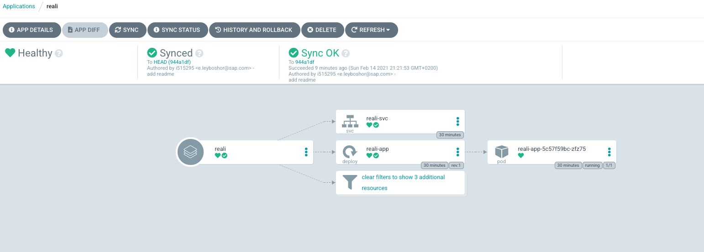

# This project has two folders

## pipeline
- build the provided application (https://github.com/reali-devops/python-app)
- push it to a docker hub (einavl)
- sync the helm application (integrate with argoCD)

## reali
 - define the k8s application that runs the provided sample above
 
 
 ## Pipline image
 
  
 
## ArgoCD App
 
